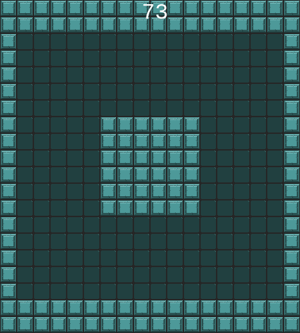

These installation instructions are under construction. Please contribute!

First, clone this directory _and_ its submodules (necessary for only for evolving diverse generators):

```
git clone --recurse-submodules https://github.com/smearle/control-pcgrl
cd control-pcgrl
```
(repo address will be `git@github.com:smearle/control-pcgrl` if using SSH).

Then, (un)comment the relevant lines in `setup.sh` to install torch with(out) GPU/CUDA enabled for your machine. Then run:
```
bash setup.sh
```

Note that the `pytorch-neat` and `qdpy` submodules are only necessary for evolving diverse generators (not RL).

Run experiments by editing the `batch.yaml` files in either `configs/evo` or `configs/rl`, then running `run_batch_evo.py` or `run_batch_rl.py`, which in turn launch the scripts `evo/evolve.py` or `rl/train_ctrl.py`, respectively, either locally (sequentially, with option `--local`), or on SLURM (in parallel).

See `gym_pcgrl` for the original Readme, from amidos2006/gym-pcgrl.

The below instructions, for controllable RL and evolving diverse generators, respectively, are out of date.

# Readme: Illuminating Diverse Neural Cellular Automata for Level Generation

<p align="center">
	
	
</p>

This is the codebase used to generate the results presented in the paper available on [arxiv](https://arxiv.org/abs/2109.05489). It builds on the codebase for PCGRL, whose readme is included below for reference. 

To generate the results presented in the maze domain, in Table 1 of the paper, run `python evo_batch.py` on a SLURM cluster, or `python evo_batch.py --local` on a local machine. This will launch a series of experiments (either on separate nodes of a cluster or in sequence on a local machine). If you're on a SLURM cluster, you'll need to replace my email with your own, in `evo_train.sh` and `evo_eval.sh`.

The `evo_batch.py` file essentially repeatedly calls `python evolve.py` with particular sets of hyperparameters, so you may also want to experiment with calling that file directly---just be sure to take a look at all the arguments (visible with `python evolve.py -h` or in `evo_args.py` that can be provided (and note that in the paper, we always provide the flag `--fix_elites` since the re-evaluation of elites during training was found to mostly have a negative effect on the final archive). Results will be saved in the `evo_runs` directory, every `--save_interval`-many generations. Adding the `--render` option when calling `evo_batch.py` or `evolve.py` will render the level-generation process in real-time, during either training or evaluation. The former can be useful for debugging, or to get an intuitive sense of what the system is doing, but note that it will slow training down quite drastically.

To evaluate saved archives, run `python evo_batch.py --evaluate` (which essentially calls `python evolve.py --infer --evaluate`). To visualize the results of cross-evaluation in a table, run `python evo_batch.py --local --cross_eval --tex` (running without `--tex` will generate a large html with all results instead a of a tex file with only a focused subset of results). The table-generation is automated in `evo_cross_eval.py`. To render gifs from the level frames that were saved during evaluation, run `python evo_batch.py --local --gifs`.


## Installation

Clone this repository along with its submodules:

```git clone --recurse-submodules -j8 https://github.com/smearle/control-pcgrl```

It is recommended to use a virtual environment using anaconda or similar. We use python 3.8.

```
conda create -n pcgrl python=3.7
conda activate pcgrl
```

To install the required python packages, it should suffice to run

```python -m pip install -r requirements.txt```

If the above causes errors, the offending lines can be commented out, and any missing packages installed manually. GTK and PyGObject are required for rendering controllable PCGRL agents, but are not used in the above pipeline for training diverse generators. If you encounter errors relating to these packages while attempting to run the above pipeline, they can be installed with:

```conda install -c conda-forge pygobject gtk3```

Using [Evocraft](https://github.com/real-itu/Evocraft-py) to render in Minecraft

# Readme: Learning Controllable Content Generators

This repo also contains the code for the [paper](https://ieee-cog.org/2021/assets/papers/paper_162.pdf) presented at CoG 2021.

This code requires pygobject and gtk3 (installation described above), and stable-baselines 2 and tensorflow 1 (installation described below).

To train, visualize, and evaluate a controllable generator, run `train_ctrl.py`, `infer_ctrl.py` and `evaluate_ctrl.py`, respectively.