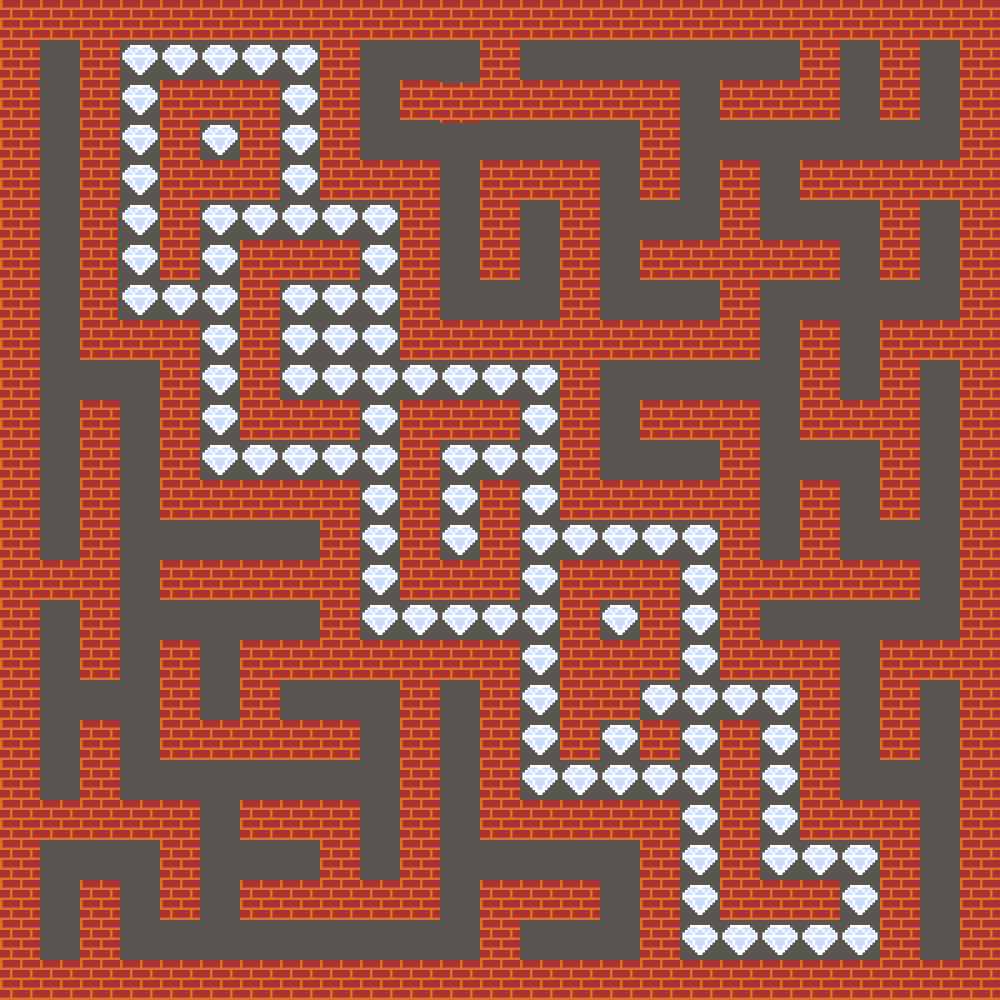
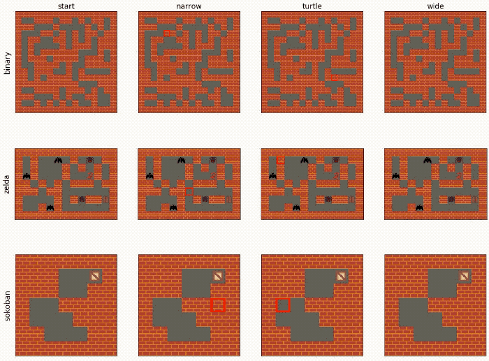

These installation instructions are under construction. Feel free to contribute.
 
***NOTE: Currently porting RL experiment loop to hydra/submitit:***

Config files and hyperparemeter sweeps can be found in `configs/rl`

```
train_pcgrl
``` 
will train an RL generator with the default settings given in `config.yaml`. (The main config class `ControlPCGRLConfig` can be found in `config.py`.)

```
train_pcgrl -m +experiment=learning_rates
``` 
will conduct a hyperparameter sweep over learning rates as defined in `learning_rates.yaml`

This multirun will laumch on SLURM by default. This can be changed in `config.yaml` or by adding `+hydra.launcher=submitit_local` to the command line.

***END NOTE!!!***

First, clone this directory _and_ its submodules (necessary for only for evolving diverse generators):

```
git clone --recurse-submodules https://github.com/smearle/control-pcgrl
cd control-pcgrl
```
(repo address will be `git@github.com:smearle/control-pcgrl` if using SSH).

Then, (un)comment the relevant lines in `setup.sh` to install torch with(out) GPU/CUDA enabled for your machine. Then run:
```
bash setup.sh
```

Note that the `pytorch-neat` and `qdpy` submodules are only necessary for evolving diverse generators (not RL).

Run experiments by editing the `batch.yaml` files in either `configs/evo` or `configs/rl`, then running `run_batch_evo.py` or `run_batch_rl.py`, which in turn launch the scripts `evo/evolve.py` or `rl/train_ctrl.py`, respectively, either locally (sequentially, with option `--local`), or on SLURM (in parallel).

See `gym_pcgrl` for the original Readme, from amidos2006/gym-pcgrl.

The below instructions, for controllable RL and evolving diverse generators, respectively, are out of date.

# Readme: Illuminating Diverse Neural Cellular Automata for Level Generation

<p align="center">
	
	
</p>

This is the codebase used to generate the results presented in the paper available on [arxiv](https://arxiv.org/abs/2109.05489). It builds on the codebase for PCGRL, whose readme is included below for reference. 

To generate the results presented in the maze domain, in Table 1 of the paper, run `python evo_batch.py` on a SLURM cluster, or `python evo_batch.py --local` on a local machine. This will launch a series of experiments (either on separate nodes of a cluster or in sequence on a local machine). If you're on a SLURM cluster, you'll need to replace my email with your own, in `evo_train.sh` and `evo_eval.sh`.

The `evo_batch.py` file essentially repeatedly calls `python evolve.py` with particular sets of hyperparameters, so you may also want to experiment with calling that file directly---just be sure to take a look at all the arguments (visible with `python evolve.py -h` or in `evo_args.py` that can be provided (and note that in the paper, we always provide the flag `--fix_elites` since the re-evaluation of elites during training was found to mostly have a negative effect on the final archive). Results will be saved in the `evo_runs` directory, every `--save_interval`-many generations. Adding the `--render` option when calling `evo_batch.py` or `evolve.py` will render the level-generation process in real-time, during either training or evaluation. The former can be useful for debugging, or to get an intuitive sense of what the system is doing, but note that it will slow training down quite drastically.

To evaluate saved archives, run `python evo_batch.py --evaluate` (which essentially calls `python evolve.py --infer --evaluate`). To visualize the results of cross-evaluation in a table, run `python evo_batch.py --local --cross_eval --tex` (running without `--tex` will generate a large html with all results instead a of a tex file with only a focused subset of results). The table-generation is automated in `evo_cross_eval.py`. To render gifs from the level frames that were saved during evaluation, run `python evo_batch.py --local --gifs`.


## Installation

Clone this repository along with its submodules:

```git clone --recurse-submodules -j8 https://github.com/smearle/control-pcgrl```

It is recommended to use a virtual environment using anaconda or similar. We use python 3.8.

```
conda create -n pcgrl python=3.7
conda activate pcgrl
```

To install the required python packages, it should suffice to run

```python -m pip install -r requirements.txt```

If the above causes errors, the offending lines can be commented out, and any missing packages installed manually. GTK and PyGObject are required for rendering controllable PCGRL agents, but are not used in the above pipeline for training diverse generators. If you encounter errors relating to these packages while attempting to run the above pipeline, they can be installed with:

```conda install -c conda-forge pygobject gtk3```

Using [Evocraft](https://github.com/real-itu/Evocraft-py) to render in Minecraft

# Readme: Learning Controllable Content Generators

This repo also contains the code for the [paper](https://ieee-cog.org/2021/assets/papers/paper_162.pdf) presented at CoG 2021.

This code requires pygobject and gtk3 (installation described above), and stable-baselines 2 and tensorflow 1 (installation described below).

To train, visualize, and evaluate a controllable generator, run `train_ctrl.py`, `infer_ctrl.py` and `evaluate_ctrl.py`, respectively.

# PCGRL

***NOTE: This is out of date and should be updated to reflect changes to the environment.***

<p align="center">
	
</p>

<h1 align="center">
	PCGRL OpenAI GYM Interface
</h1>

<p align="center">
  <b>Current Framework Version: 0.4.0</b>
</p>

An [OpenAI GYM](https://gym.openai.com/) environment for Procedural Content Generation via Reinforcement Learning (PCGRL).

The framework, along with some initial reinforcement learning results, is covered in the paper [PCGRL: Procedural Content Generation via Reinforcement Learning](https://arxiv.org/abs/2001.09212). This paper should be cited if code from this project is used in any way:
<!-- ```
@inproceedings{khalifa2020pcgrl,
  title={PCGRL: Procedural Content Generation via Reinforcement Learning},
  author={Khalifa, Ahmed and Bontrager, Philip and Earle, Sam and Togelius, Julian},
  booktitle={IJCAI},
  year={2020}
}
``` -->
```
@misc{khalifa2020pcgrl,
    title={PCGRL: Procedural Content Generation via Reinforcement Learning},
    author={Ahmed Khalifa and Philip Bontrager and Sam Earle and Julian Togelius},
    year={2020},
    eprint={2001.09212},
    archivePrefix={arXiv},
    primaryClass={cs.LG}
}
```

## Installation
1. Clone this repo to your local machine.
2. To install the package, run `pip install -e .` from inside the repo folder. (Don't worry it will install OpenAI GYM environment automatically, otherwise you can install it first by following that [link](https://github.com/openai/gym#installation))
3. If everything went fine, the PCGRL gym interface is ready to be used. Check the [following section](https://github.com/amidos2006/gym-pcgrl#usage) on how to use it.

## Usage
The PCGRL GYM interface has multiple different environments, where each environment consists of two parts: a problem and a representation. All the environments follow the following name conventions:
```
[problem_name]-[representation_name]-[version]
```
For the full list of supported problems names check the [Supported Problems](https://github.com/amidos2006/gym-pcgrl#supported-problems) section and for the full list of the supported representations name check the [Supported Representations](https://github.com/amidos2006/gym-pcgrl#supported-representations) section.

To list all the registered environments, you can run the following code:
```python
from gym import envs
import gym_pcgrl

[env.id for env in envs.registry.all() if "gym_pcgrl" in env.entry_point]
```

After installing the interface, you can use it like any other GYM interface. Here is a simple example on how to use the framework on the Sokoban environment with Narrow representation:

```python
import gym
import gym_pcgrl

env = gym.make('sokoban-narrow-v0')
obs = env.reset()
for t in range(1000):
  action = env.action_space.sample()
  obs, reward, done, info = env.step(action)
  env.render('human')
  if done:
    print("Episode finished after {} timesteps".format(t+1))
    break
```

Beside the OpenAI GYM traditional functions. Our interface supports additional functionalities such as:
- `self.get_num_tiles()`: This function get the number of different tiles that can appear in the observation space
- `get_border_tile()`: This function get the tile index to be used for padding a certain problem. It is used by certain wrappers.
- `adjust_param(**kwargs)`: This function that helps adjust the problem and/or representation parameters such as modifying `width` and `height` of the generated map.

## Supported Problems
Problems are the current games that we want to apply PCGRL towards them. The following table lists all the supported problems in the interface:

| Name     | Goal                                                                                                                                                                        | Tile Values                                                                                                                                                |
|----------|-----------------------------------------------------------------------------------------------------------------------------------------------------------------------------|------------------------------------------------------------------------------------------------------------------------------------------------------------|
| binary   | Generate a fully connected top down layout where the increase in the longest path is greater than a certain threshold                                                                       | 0: empty, 1: solid                                                                                                                                         |
| ddave    | Generate a fully connected level for a simple platformer similar to [Dangerous Dave](http://www.dangerousdave.com) where the player has to jump at least 2 times to finish  | 0: empty, 1: solid, 2: player, 3: exit, 4: diamonds, 5: trophy (act like a key for the exit), 6: spikes                                                    |
| mdungeon | Generate a fully connected level for a simple dungeon crawler similar to [MiniDungeons 1](http://minidungeons.com/) where the player has to kill 50% of enemies before done | 0: empty, 1: solid, 2: player (max of 5 health), 3: exit, 4: potion (restores 2 health), 5: treasure, 6: goblin (deals 1 damage), 7: ogre (deals 2 damage) |
| sokoban  | Generate a fully connected [Sokoban](https://en.wikipedia.org/wiki/Sokoban) level that can be solved                                                                        | 0: empty, 1: solid, 2: player, 3: crate (to be pushed toward the target), 4: target (the location where the crate should ends)                             |
| zelda    | Generate a fully connected [GVGAI](http://gvgai.net/) zelda level where the player can reach key then the door | 0: empty, 1: solid, 2: player, 3: key (to be collected before the door), 4: door (to win the level), 5: bat (should be avoided), 6: scorpion (should be avoided), 7: spider (should be avoided) |
| smb      | Generate a simplified and playable Super Mario Bros level where there is at least 20 jumps in the level | 0: empty, 1: solid, 2: enemy, 3: brick, 4: question, 5: coin, 6: tube (need 2 beside each other) |

## Supported Representations
Representations are the way the Procedural Content Generation problem is formatted as a [Markov Decision Process](https://en.wikipedia.org/wiki/Markov_decision_process) to be able to use it for reinforcement learning. All the problems can be represented using any of the supported representations. The following table shows all the supported representations in the interface:

| Name   | Observation Space                                                                                  | Action Space                                                                                                                             |
|--------|----------------------------------------------------------------------------------------------------|------------------------------------------------------------------------------------------------------------------------------------------|
| narrow      | 2D Box of integers that represent the map and 1D Box of integers that represents the x, y position | One Discrete space that represents the new tile value and no change action                                                                                    |
| narrowcast  | 2D Box of integers that represent the map and 1D Box of integers that represents the x, y position | Two Discrete spaces that represent the type of change (no change, single, 3x3 grid) and the new tile value       |
| narrowmulti | 2D Box of integers that represent the map and 1D Box of integers that represents the x, y position | Nine Discrete spaces that represent the new tile value and no change action                                                          |
| wide        | 2D Box of integers that represent the map                                     | Three Discrete spaces that represent the x position, y position, new tile value                                                          |
| turtle      | 2D Box of integers that represent the map and 1D Box of integers that represents the x, y position | One Discrete space where the first 4 actions move the turtle (left, right, up, or down) while the rest of actions are for the tile value |
| turtlecast  | 2D Box of integers that represent the map and 1D Box of integers that represents the x, y position | Two Discrete spaces that represents movement+type and tile values. The first space represents 4 actions to move the turtle (left, right, up, or down) while the rest of actions are type of change (1 tile, 3x3 grid) |

The `narrow`, `wide`, and `turtle` representation are adapted from [Tree Search vs Optimization Approaches for Map Generation](https://arxiv.org/pdf/1903.11678.pdf) work by Bhaumik et al.

## Create your own problem
Create the new problem class in the `gym_pcgrl.envs.probs` and extends `Problem` class from `gym_pcgrl.envs.probs.problem`. This class has to implement the following functions.
```python
def __init__(self):
  super().__init__()
  ...

def get_tile_types(self):
  ...

def get_stats(self, map):
  ...

def get_reward(self, new_stats, old_stats):
  ...

def get_episode_over(self, new_stats, old_stats):
  ...

def get_debug_info(self, new_stats, old_stats):
  ...
```
Also, you need to make sure that you setup the following parameters in the constructor:
- `self._width`: the generated map width.
- `self._height`: the generated map height.
- `self._prob`: a dictionary for all the game tiles where keys are the tile names and the values are the probability of the tile appearing when initializing a random map.
- `self._border_size`: the size of the border added around the generated level (in a lot of games there might be a border surrounding the level, it is a good idea to get that out).
- `self._border_tile`: the tile name used for the border.
- `self._tile_size`: the size of the tile in pixels to be used in rendering.
- `self._graphics`: a dictionary for all the game graphics where keys are the tile names and values are the Pillow images for rendering the problem.

Feel free to override any other function if you need a behavior different from the normal behavior. For example: In all our problems, we want our system to not load the graphics unless it is going to render it. We override `render()` function so we can initialize `self._graphics` at the beginning of the `render()` instead of the constructor.

After implementing your own class, you need to add the name and the class in `gym_pcgrl.envs.probs.PROBLEMS` dictionary that can be found in [\_\_init\_\_.py](https://github.com/amidos2006/gym-pcgrl/blob/master/gym_pcgrl/envs/probs/__init__.py) the key name is used as the problem name for the environment and the value is to refer to the main class that it need to construct for that problem.

## Create your own representation
Create the new representation class in the `gym_pcgrl.envs.reps` and extends `Representation` class from `gym_pcgrl.envs.reps.representation`. This class has to implement the following functions.
```python
def __init__(self, width, height, prob):
  super().__init__(width, height, prob)
  ...

def get_action_space(self):
  ...

def get_observation_space(self):
  ...

def get_observation(self):
  ...

def update(self, action):
  ...
  # boolean to define where the change happened and x,y for the location of change if it happened
  return change, x, y
```
Feel free to override any other function if you need a behavior different from the normal behavior. For example: in the `narrow` representation, we wanted to show the location where the agent should change on the rendered image. We override the `render()` function to draw a red square around the correct tile.

After implementing your own class, you need to add the name and the class in `gym_pcgrl.envs.reps.REPRESENTATIONS` dictionary that can be found in [\_\_init\_\_.py](https://github.com/amidos2006/gym-pcgrl/blob/master/gym_pcgrl/envs/reps/__init__.py) the key name is used as the representation name for the environment and the value is to refer to the main class that it need to construct for that representation.

## Running train.py
[train.py](https://github.com/amidos2006/gym-pcgrl/blob/master/train.py) uses stable baseline PPO2 algorithm for training. You can configure [train.py](https://github.com/amidos2006/gym-pcgrl/blob/master/train.py) to train for different problems or different representation by changing the game and representation parameters in the file to a different problem and/or representation.

To read more about the experiments and the different wrappers, check our paper [PCGRL: Procedural Content Generation via Reinforcement Learning](https://arxiv.org/abs/2001.09212).

You can run the code either using the Dockerfile using the following command line after installing [Docker](https://www.docker.com/):
```sh
docker image build -t pcgrl:latest . && docker run --runtime=nvidia pcgrl:latest
```
Another way is to use [Conda](https://www.anaconda.com/) by creating a virtual environment then activating it and installing all the dependencies for [train.py](https://github.com/amidos2006/gym-pcgrl/blob/master/train.py):
```sh
conda create --name pcgrl
conda activate pcgrl
pip install tensorflow==1.15
pip install stable-baselines==2.9.0
cd gym_pcgrl
pip install -e .
cd ..
python train.py
```
Lastly, you can just install directly without using any virtual environment:
```sh
pip install tensorflow==1.15
pip install stable-baselines==2.9.0
cd gym_pcgrl
pip install -e .
cd ..
python train.py
```

PS: The training process will create a folder named `runs/` where two folders will appear one for tensorboard logs and the other for the saved models. The training is always saving the best model so far and the last model.

## Running Trained Model
First make sure you have all required modules ([GYM PCGRL](https://github.com/amidos2006/gym-pcgrl), [Tensorflow](https://www.tensorflow.org/), and [Stable Baselines](https://stable-baselines.readthedocs.io/en/master/)) are installed either using [Docker](https://www.docker.com/), [Conda](https://www.anaconda.com/), or Pip directly. The code to run is similar to the above code for training just change [train.py](https://github.com/amidos2006/gym-pcgrl/blob/master/train.py) to [inference.py](https://github.com/amidos2006/gym-pcgrl/blob/master/inference.py).

In the case, that you want to use [jupyter notebook](https://jupyter.org/), please check [inference.ipynb](https://github.com/amidos2006/gym-pcgrl/blob/master/inference.ipynb). Please, make sure to choose the correct kernel (especially if you are using [Conda](https://www.anaconda.com/) virtual environments) before running anything.

Here is a cool GIF when running these models:

<p align="center">
	
</p>

PS: All the models for Sokoban Narrow, Sokoban Turtle, and the third model of Zelda Turtle has been saved using python 3.5 which have a different serialization method than python 3.6 and 3.7. When try to load them in python 3.6 or 3.7, you will get an unknown op code error so make sure that you are using the correct python version. We apologize for this mess and we are working on training new models using python 3.7 to replace these ones. Remember if you get unknown opcode, it is because of the serialization method. We didn't know about that issue until later, sorry again for any inconvenience. One last note, Python 3.6 can't load Binary Narrow and Zelda Narrow so make sure to use python 3.7 for all the models except the one that needs python 3.5.

## Contributing
Bug reports and pull requests are welcome on GitHub at [https://github.com/amidos2006/gym-pcgrl](https://github.com/amidos2006/gym-pcgrl).

## License
This code is available as open source under the terms of the [MIT License](https://opensource.org/licenses/MIT).